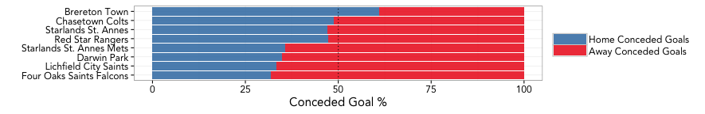
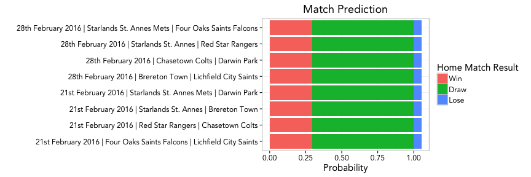

### Current League Table Results


|Team                     | Played| Won| Drawn| Lost| For| Against| Diff| Points|
|:------------------------|------:|---:|-----:|----:|---:|-------:|----:|------:|
|Chasetown Colts          |     10|   7|     3|    0|  45|      17|   28|     24|
|Darwin Park              |     10|   7|     0|    3|  45|      18|   27|     21|
|Lichfield City Saints    |     13|   5|     1|    7|  35|      36|   -1|     16|
|Red Star Rangers         |      8|   5|     0|    3|  24|      20|    4|     15|
|Starlands St. Annes      |      9|   4|     0|    5|  26|      37|  -11|     12|
|Four Oaks Saints Falcons |      9|   3|     1|    5|  19|      35|  -16|     10|
|Starlands St. Annes Mets |      8|   3|     0|    5|  20|      32|  -12|      9|
|Brereton Town            |     11|   2|     1|    8|  18|      37|  -19|      7|

--- .class #id 

### Average Scored and Conceded Goals for each Team 


This shows that Saints attack side is weaker that most, however Saints defense side is better than most.

--- .class #id 

### Home Advantage



  
This shows that there is no home advantage for the Saints in attack, however the home advantage is clearly seen in defence.

--- .class #id 

### Goal Distribution Per Match


--- .class #id 

### Remaining Fixtures

|   |Date               |HomeTeam                 |AwayTeam                 |
|:--|:------------------|:------------------------|:------------------------|
|40 |28th February 2016 |Brereton Town            |Lichfield City Saints    |
|41 |28th February 2016 |Chasetown Colts          |Darwin Park              |
|42 |28th February 2016 |Starlands St. Annes      |Red Star Rangers         |
|43 |28th February 2016 |Starlands St. Annes Mets |Four Oaks Saints Falcons |
|44 |6th March 2016     |Starlands St. Annes Mets |Chasetown Colts          |
|45 |6th March 2016     |Starlands St. Annes      |Darwin Park              |
|46 |6th March 2016     |Red Star Rangers         |Four Oaks Saints Falcons |
|47 |13th March 2016    |Brereton Town            |Four Oaks Saints Falcons |
|48 |13th March 2016    |Red Star Rangers         |Starlands St. Annes Mets |
|49 |13th March 2016    |Starlands St. Annes      |Chasetown Colts          |

--- .class #id 

### Match Predictions for Remaining Fixture


Simulation using a trained GLM/Poisson model setup with league results, goal rates and home advantage for each team. It's not taking into account, form and motivation of the players.

--- .class #id 

### Adjusted Match Predictions for Remaining Fixture


```
## Warning: Stacking not well defined when ymin != 0
```




